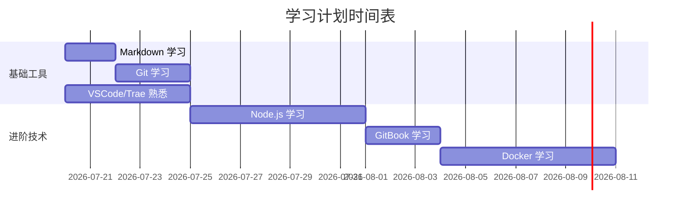

```mermaid
gantt
    title 学习计划时间表
    dateFormat  YYYY-MM-DD
    section 基础工具
    Markdown 学习       :a1, 2026-07-20, 2d
    Git 学习            :a2, after a1, 3d
    VSCode/Trae 熟悉    :a3, 2026-07-20, 5d
    section 进阶技术
    Node.js 学习        :b1, after a2, 7d
    GitBook 学习        :b2, after b1, 3d
    Docker 学习         :b3, after b2, 7d
```