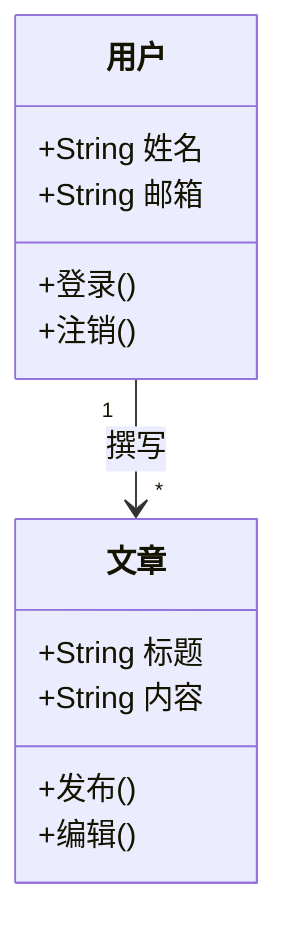

```mermaid
classDiagram
    class 用户 {
        +String 姓名
        +String 邮箱
        +登录()
        +注销()
    }
    class 文章 {
        +String 标题
        +String 内容
        +发布()
        +编辑()
    }
    用户 "1" --> "*" 文章 : 撰写
```