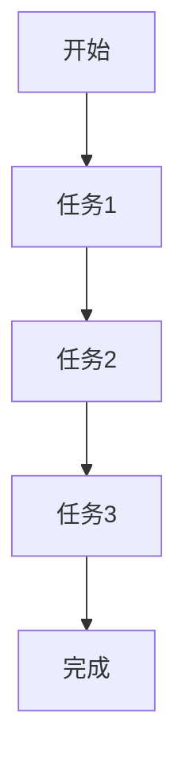
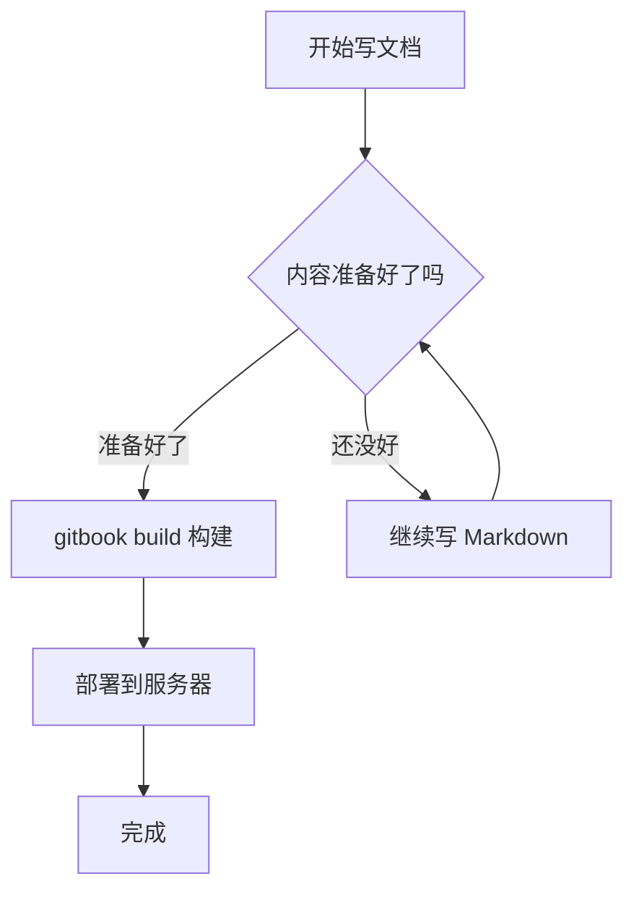
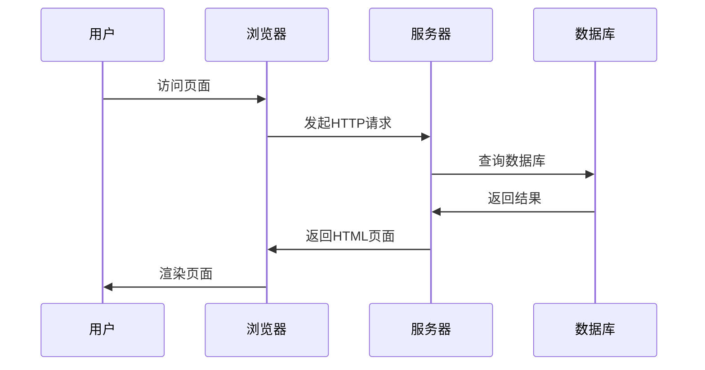

# Markdown

## 二级标题

### 三级标题


## 列表

- 苹果
- 香蕉
    - 大蕉
    - 小米蕉

[访问github](https://github.com/)

## 代码

```javascript
function greet（name）{
    console.log("你好，" + name);
}
greet("张三");

```
## 表格
| 姓名 | 年龄 |
| --- | --- |
| 张三 | 18 |
| 李四 | 20 |
| 王五 | 22 |


## 引用
> 这是一个引用
> 这是第二个引用


## 任务列表
- [x] 任务1
- [x] 任务2
- [ ] 任务3





<details>
    <summary>这是一个摘要</summary>
    这是一个详细的内容
</details>

---
* 这是一个列表项
* 这是第二个列表项
***

保存文件请按<kbd>Ctrl</kbd>+<kbd>S</kbd>
或<kbd>Cmd</kbd>+<kbd>S</kbd>
。


<div align="center">
## 居中

</div>

<span style="color: red;">这是一个红色的文本</span>

<span style="color: blue;">这是一个蓝色的文本</span>


## 脚注示例

Markdown 由 John Gruber 和 Aaron Swartz 共同创建[^1]。

[^1]: John Gruber 于 2004 年发布了 Markdown 的第一个版本，语法设计的初衷是"让文档既易于阅读也易于编写"。





## 段落内换行
这是一个段落。
这是一个段落。
这是一个


<https://www.baidu.com>


```javascript
function greet(name) {
    console.log(`Hello, ${name}!`);
}
greet('World');
```


| 左对齐列 | 居中对齐列 | 右对齐列 |
|:---------|:----------:|---------:|
| 单元格1  | 单元格2    | 单元格3  |
| 单元格4  | 单元格5    | 单元格6  |


<details>
<summary>点击展开查看详情</summary>

这里面是折叠的内容，默认收起。

- 第一点
- 第二点
- 第三点

</details>


$E = mc^2$ 

